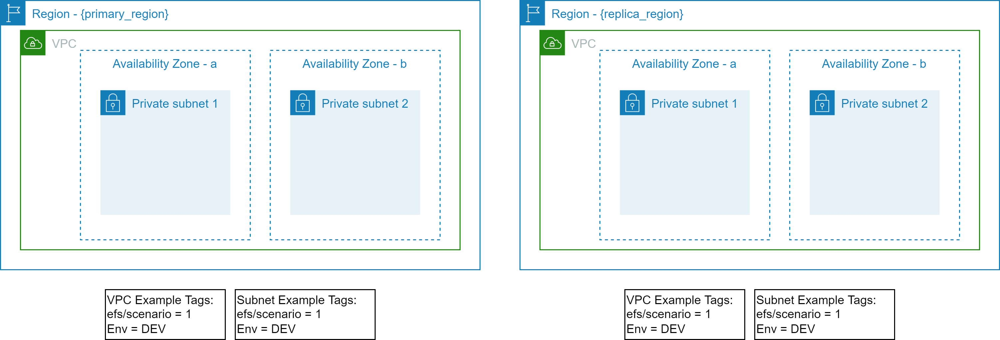
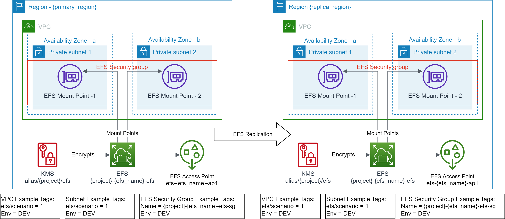

# Provision secured Amazon EFS for the enterprise use cases including backup and cross-region replica

This solution is a set of [Terraform](https://www.terraform.io/) modules that provisions secured [Amazon Elastic File System (EFS)](https://aws.amazon.com/efs/) for enterprise use cases. You can optionally create [Amazon EFS access point(s)](https://docs.aws.amazon.com/efs/latest/ug/efs-access-points.html), enable [backup](https://docs.aws.amazon.com/efs/latest/ug/efs-backup-solutions.html), or setup [cross-region replication](https://docs.aws.amazon.com/efs/latest/ug/efs-replication.html). The full set of features is listed [here](#features). The solution also provides four example scenarios of how the solution solves common enterprise use cases.

## Introduction

Amazon Elastic File System (EFS) is a Serverless, fully managed service providing Network File System (NFS) shared file system storage for the Linux workloads. It can be used to provide shared storage for containerized and Serverless applications, big data analytics, web serving and content management, application development and testing, media and entertainment workflows, and database backups.

An Amazon EFS file system can only have [mount targets](https://docs.aws.amazon.com/efs/latest/ug/how-it-works.html) in one Amazon VPC at a time. Also, only one mount target can be created in each Availability Zone in an AWS Region. If there are multiple subnets in an Availability Zone, the mount target must be created in one of the subnets. If the EFS is provisioned using One Zone storage class, it can only have a single mount target. Mount target creates an [Elastic Network Interface (ENI)](https://docs.aws.amazon.com/AWSEC2/latest/UserGuide/using-eni.html) in the target subnet. The associated security group of the ENI controls the access to this mount target. Amazon EFS also provides a DNS name that resolves to the mount target in the local availability zone. This results into an NFSv4 endpoint which can be mounted via either the DNS name (preferred) or the IP address. If on-premises data center is connected to the Amazon VPC, it can mount the Amazon EFS file system via DNS ([if resolvable from the on-premises](https://docs.aws.amazon.com/Route53/latest/DeveloperGuide/resolver.html)) or IP address (preferred).

Amazon EFS access points are entry points into an EFS file system that make it easier to manage access to shared datasets. Access points can enforce a user identity via user's POSIX groups. Access points can also enforce a root directory for the NFS mounts. IAM identity policies and resource policies can be used to control the NFS client access to Amazon EFS resources in a scalable, and optimized approach. By combining IAM policies with access points, you can easily manage secured access to the specific datasets for application(s) or other AWS principals.

Amazon EFS [replication configuration](https://docs.aws.amazon.com/efs/latest/ug/efs-replication.html) enables the Amazon EFS file system replication to another AWS Region. The destination EFS file system is encrypted and read only by design. The destination file system storage class may be Regional or One Zone, which can also be different from the source file system storage class.

*If the EFS replication configuration is removed, the replicated EFS in another region is not removed*. It is just disconnected from the source EFS. A disconnected EFS becomes writable.

## Features

The solution has following features:

- Create a [One Zone or Regional](https://docs.aws.amazon.com/efs/latest/ug/storage-classes.html) EFS with [lifecycle management](https://docs.aws.amazon.com/efs/latest/ug/lifecycle-management-efs.html) and [EFS mount target(s)](https://docs.aws.amazon.com/efs/latest/ug/manage-fs-access.html).
- Create zero or more [EFS access point(s)](https://docs.aws.amazon.com/efs/latest/ug/efs-access-points.html).
- Use default [performance mode](https://docs.aws.amazon.com/efs/latest/ug/performance.html#performancemodes) (General Purpose) and [throughput mode](https://docs.aws.amazon.com/efs/latest/ug/performance.html#throughput-modes) (Bursting) or customize it.
- Create EFS mount target(s) in the existing VPC and subnets that are identified via tags.
- Use an existing [security group](https://docs.aws.amazon.com/efs/latest/ug/network-access.html) (identified via tags) for the EFS mount target(s), or provision new security group with default rules.
- Enforce the secured access via secured-transport (TLS), mount target, or access point(s) using the EFS resource policy.
- Optionally encrypt the EFS file system using an existing AWS KMS key or provision a new AWS KMS key.
- For an existing shared EFS (identified via `efs_id`), create new shared EFS access point(s).
- Enable [automatic backup](https://docs.aws.amazon.com/efs/latest/ug/awsbackup.html#automatic-backups) using the AWS managed backup vault and backup plan; or enable [custom backup](https://docs.aws.amazon.com/efs/latest/ug/awsbackup.html#manual-backup) via adding custom tags (`efs_tags`).
- Enable One Zone or Regional [cross-region replication](https://docs.aws.amazon.com/efs/latest/ug/efs-replication.html) to another region.
  - Use an existing AWS KMS key (in the target region) to encrypt the EFS replication or provision a new AWS KMS key in the target region.
  - Create EFS mount target(s) in the existing VPC and subnets in the target region.
  - Use an existing security group (in the target region) for the EFS mount target(s), or provision a new security group in the target region.
  - Enforce the secured access via secured-transport (TLS), mount target, or access point(s) using the EFS resource policy.
  - Create zero or more EFS access point(s) in the target region for the read only purpose.
- Uniformly names and tags the provisioned resources.

## Prerequisites

- The target AWS Account(s) and AWS Region(s) are identified.
- The AWS User/Role executing the Terraform scripts must have permissions to provision the target resources in the owner account.
- The Terraform CLI (`version = ">= 1.1.9"`) is installed.
- Terraform backend provider and state locking providers are identified and bootstrapped.
  - An [example bootstrap](https://github.com/aws-samples/aws-tf-efs/tree/main/bootstrap) module/example is provided that provisions an Amazon S3 bucket for Terraform state storage and Amazon DynamoDB table for Terraform state locking.
    - The Amazon S3 bucket name must be globally unique.
- A unique project code name e.g., `appx` is identified that will be used to uniformly name the key aliases.
- Uniform resource tagging scheme is identified.
  - The examples use only two tags: `Env` and `Project`

## Usage

- Use the module via [GitHub source](https://www.terraform.io/language/modules/sources#github) or copy the module into your repository.
- Incorporate the module in your infrastructure/storage [CI](https://aws.amazon.com/devops/continuous-integration/)/[CD](https://aws.amazon.com/devops/continuous-delivery/) [pipeline](https://docs.aws.amazon.com/codepipeline/latest/userguide/concepts.html) as appropriate.
- This solution uses [external module](https://github.com/aws-samples/aws-tf-kms) to provision AWS KMS Key, if encryption is enabled and `kms_alias` is not provided.

## Scenarios

This solution primarily supports the following scenarios though many other scenarios are possible.

### Scenario 1: Create Owned Amazon EFS and Owned Amazon EFS Access Point(s)
This is the most common scenario. The lifecycle of Amazon EFS and Amazon EFS Access Point(s) is owned by a single team. Any changes to the EFS or the EFS Access Point(s) are done by the same team via the same Terraform pipeline.

#### Prerequisites

- The target VPC along with the target Subnets exist and identified via Tags.
- EFS file system does not exist.
- EFS Security Group does not exist.
- EFS mount targets do not exist in the target VPC Subnets.
- AWS KMS Key does not exist.
- EFS access point does not exist.

#### Outcome

- EFS file system is created.
- EFS Security Group is created with default rules.
- EFS mount targets are created in the target VPC Subnets.
- AWS KMS Key is created.
- EFS access point is created.
- Standardized EFS resource policy is created.

Refer [examples/efs/scenario1](https://github.com/aws-samples/aws-tf-efs/tree/main/examples/efs/scenario1/) to execute this scenario.

### Scenario 2:  Create Shared Amazon EFS with Mount Target(s)
In this scenario the lifecycle of a shared Amazon EFS and mount target(s) is owned by a centralized team. It creates a shared Amazon EFS, on which one or more application teams can create their own EFS access point(s).

#### Prerequisites

- The target VPC along with the target Subnets exist and identified via Tags.
- EFS file system does not exist.
- EFS Security Group does not exist.
- EFS mount targets do not exist in the target VPC Subnets.
- AWS KMS Key does not exist.
- EFS access point does not exist.

#### Outcome

- EFS file system is created.
- EFS Security Group is created with default rules.
- EFS mount targets are created in the target VPC Subnets.
- AWS KMS Key is created.
- Standardized EFS resource policy is created.
- No EFS access points are created.

Refer [examples/efs/scenario2](https://github.com/aws-samples/aws-tf-efs/tree/main/examples/efs/scenario2/) to execute this scenario. This is required step for [examples/efs/scenario3](https://github.com/aws-samples/aws-tf-efs/tree/main/examples/efs/scenario3/)

### Scenario 3: Create Owned EFS Access Point(s) on an existing Shared Amazon EFS
In this scenario the lifecycle of Amazon EFS Access Point(s) is owned by the application team. It creates EFS access point(s) on an existing EFS (identified via `efs_id`) created by the centralized team.

#### Prerequisites

- The target VPC along with the target Subnets exist and identified via Tags.
- EFS file system exist and identified via `efs_id`
- EFS Security Group exist.
- EFS mount targets exist in the VPC Subnets.
- AWS KMS Key exists and encrypts the EFS file system.
- The required EFS access point does not exist.

#### Outcome

- EFS access point is created.
- Standardized EFS resource policy is updated.

Refer [examples/efs/scenario3](https://github.com/aws-samples/aws-tf-efs/tree/main/examples/efs/scenario3/) to execute this scenario. The [examples/efs/scenario2](https://github.com/aws-samples/aws-tf-efs/tree/main/examples/efs/scenario2/) must be executed before executing this scenario.

*Note: Do not use `terraform destroy` to remove EFS access point(s) from shared EFS, as this will remove the EFS resource policy. Use `efs_access_point_specs` variable to remove any unwanted access point(s).*

### Scenario 4: Create Amazon EFS and Amazon EFS Access Point(s) with replication enabled to another region
This scenario demonstrates the Amazon EFS file system replication. The Amazon EFS file system can be replicated to the same or another AWS Region. The replicated file system just replicates the storage. It does not create the mount target(s) or replicate the access point(s). This solution not only replicates the Amazon EFS file system but also creates the specified mount targets and access points(s).

#### Prerequisites

- The target VPC along with the target Subnets exist and identified via Tags.
- EFS file system does not exist.
- EFS Security Group does not exist.
- EFS mount targets do not exist in the target VPC Subnets.
- AWS KMS Key does not exist.
- EFS access point does not exist.
- EFS replication does not exists
- The target VPC along with the target Subnets exist and identified via Tags in the `replica_region`
- EFS Security Group does not exist in the `replica_region`.
- EFS mount targets do not exist in the target VPC Subnets in the `replica_region`.
- EFS access point does not exist in the `replica_region`.

#### Outcome

- EFS file system is created.
- EFS Security Group is created with default rules.
- EFS mount targets are created in the target VPC Subnets.
- AWS KMS Key is created.
- EFS access point(s) are created.
- Standardized EFS resource policy is created.
- AWS KMS Key is created in the `replica_region`
- EFS replication is created in the `replica_region`
- EFS Security Group is created in the `replica_region` with default rules.
- EFS mount targets are created in the target VPC Subnets in the `replica_region`.
- EFS access point(s) are created in the `replica_region`.
- Standardized EFS resource policy is created in the `replica_region`

Refer [examples/efs/scenario4](https://github.com/aws-samples/aws-tf-efs/tree/main/examples/efs/scenario4/) to execute this scenario.

*Note: When this scenario is destroyed the EFS file system in the `replica_region` becomes disconnected. For clean-up it must be manually destroyed.*

## Future Enhancements

- Amazon EFS replication configuration turns off the lifecycle management for the destination file system. Current version of the Terraform does not support specifying lifecycle management for an existing Amazon EFS file system. When such support is available, the solution can be enhanced to enable lifecycle management on the destination file system.

## Security

See [CONTRIBUTING](https://github.com/aws-samples/aws-tf-efs/blob/main/CONTRIBUTING.md#security-issue-notifications) for more information.

## License

This library is licensed under the MIT-0 License. See the [LICENSE](https://github.com/aws-samples/aws-tf-efs/blob/main/LICENSE) file.
