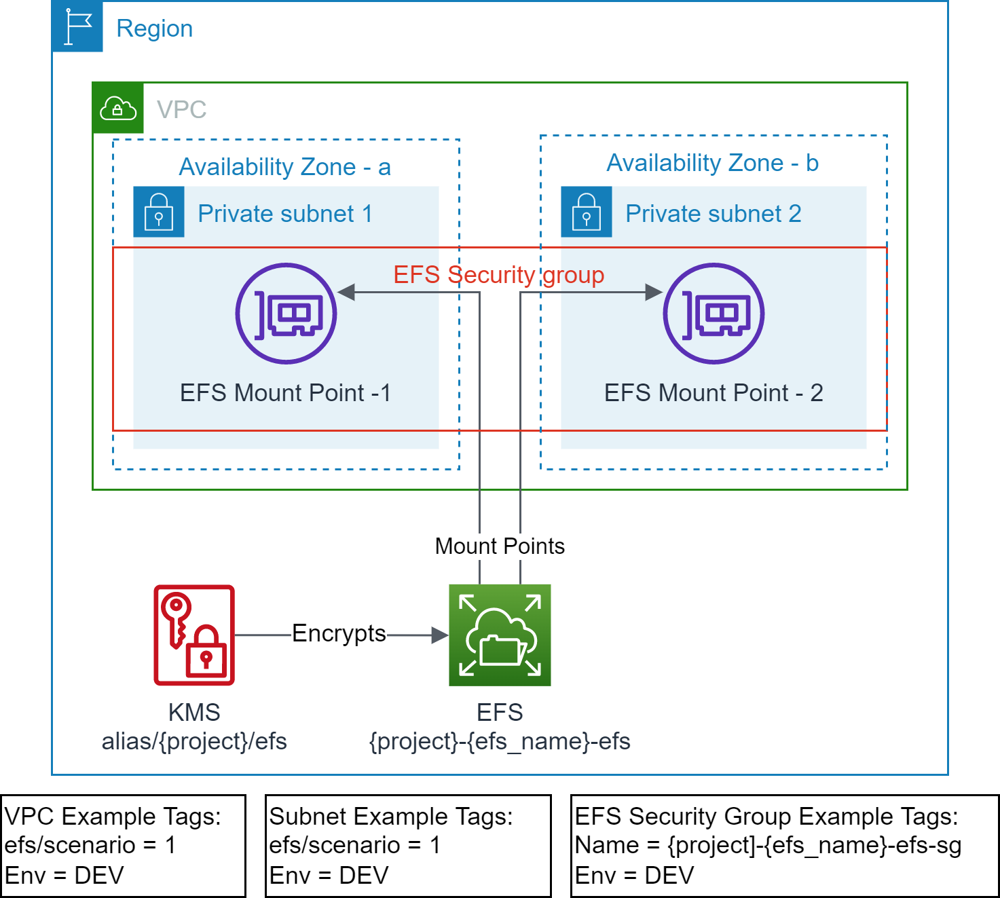
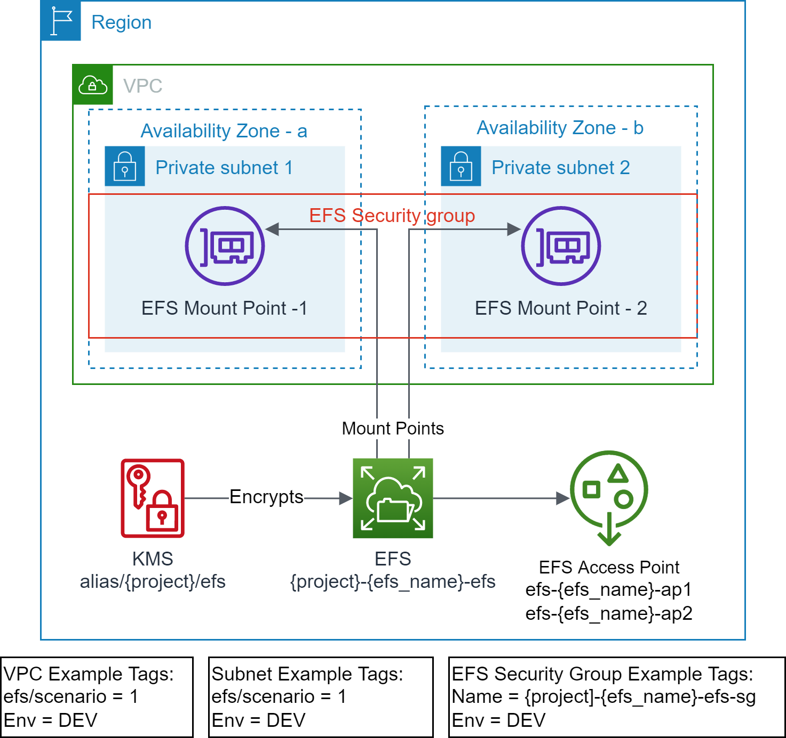

# Scenario 3: Create Owned EFS Access Point(s) on an existing Shared Amazon EFS
In this scenario, the lifecycle of Amazon EFS Access Point(s) is owned by the application team. It creates EFS access point(s) on an existing EFS (identified via `efs_id`) created by the centralized team.

## Prerequisites

<p align="center"></p>

- Terraform backend provider and state locking providers are identified and bootstrapped.
  - An [example bootstrap](../../../bootstrap) module/example is provided that provision Amazon S3 for Terraform state storage and Amazon DynamoDB for Terraform state locking.
- The target VPC along with the target Subnets exist and are identified via Tags.
  - The example uses the following tags to identify the target VPC and Subnets.
    ```text
    "efs/scenario" = "1"
    "Env"          = "DEV"
    ```
- EFS file system exist and identified via `efs_id`
- EFS mount points exist in the VPC Subnets.
- EFS Security Group exist.
- The required EFS access point does not exist.

## Outcome

<p align="center"></p>

- EFS access point is created.
- Standardized EFS resource policy is updated.

The [scenario2](../scenario2/) must be executed before executing this scenario.

*Note: Do not use `terraform destroy` to remove EFS access point(s) from shared EFS, as this will remove the EFS resource policy. Use `efs_access_point_specs` variable to remove any unwanted access point(s).*

## Execution

- cd to `examples/efs/scenario2` folder.
- Modify the `backend "S3"` section in `provider.tf` with correct values for `region`, `bucket`, `dynamodb_table`, and `key`.
  - Use provided values as guidance.
- Modify `terraform.tfvars` to your requirements.
  - Use provided values as guidance.
  - *e.g. use efs_id from scenario2*
- Make sure you are using the correct AWS Profile that has permission to provision the target resources.
  - `aws sts get-caller-identity`
- Execute `terraform init` to initialize Terraform.
- Execute `terraform plan` and verify the changes.
- Execute `terraform apply` and approve the changes to provision the resources.

<!-- BEGIN_TF_DOCS -->
## Requirements

| Name | Version |
|------|---------|
| <a name="requirement_terraform"></a> [terraform](#requirement\_terraform) | >= v1.1.9 |
| <a name="requirement_aws"></a> [aws](#requirement\_aws) | >= 4.13.0 |

## Providers

No providers.

## Modules

| Name | Source | Version |
|------|--------|---------|
| <a name="module_shared_efs"></a> [shared\_efs](#module\_shared\_efs) | ../../../modules/aws/efs | n/a |

## Resources

No resources.

## Inputs

| Name | Description | Type | Default | Required |
|------|-------------|------|---------|:--------:|
| <a name="input_env_name"></a> [env\_name](#input\_env\_name) | Environment name e.g. dev, prod | `string` | n/a | yes |
| <a name="input_project"></a> [project](#input\_project) | Project name (prefix/suffix) to be used on all the resources identification | `string` | n/a | yes |
| <a name="input_region"></a> [region](#input\_region) | The AWS Region e.g. us-east-1 for the environment | `string` | n/a | yes |
| <a name="input_tags"></a> [tags](#input\_tags) | Common and mandatory tags for the resources | `map(string)` | n/a | yes |
| <a name="input_efs_access_point_specs"></a> [efs\_access\_point\_specs](#input\_efs\_access\_point\_specs) | List of EFS Access Point Specs to be created. It can be an empty list. | <pre>list(object({<br>    efs_ap          = string # unique name e.g. common_sftp<br>    uid             = number<br>    gid             = number<br>    secondary_gids  = list(number)<br>    root_path       = string # e.g. /{env}/{project}/{purpose}/{name}<br>    owner_uid       = number # e.g. 0<br>    owner_gid       = number # e.g. 0<br>    root_permission = string # e.g. 0755<br>    principal_arns  = list(string)<br>  }))</pre> | `[]` | no |
| <a name="input_efs_id"></a> [efs\_id](#input\_efs\_id) | EFS File System Id, if not provided, a new EFS will be created | `string` | `null` | no |

## Outputs

| Name | Description |
|------|-------------|
| <a name="output_efs"></a> [efs](#output\_efs) | Elastic File System info |
| <a name="output_efs_ap"></a> [efs\_ap](#output\_efs\_ap) | Elastic File System Access Points |
<!-- END_TF_DOCS -->
