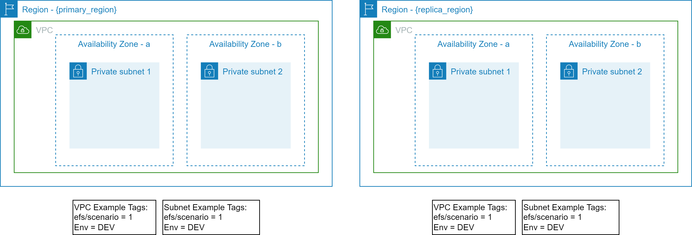
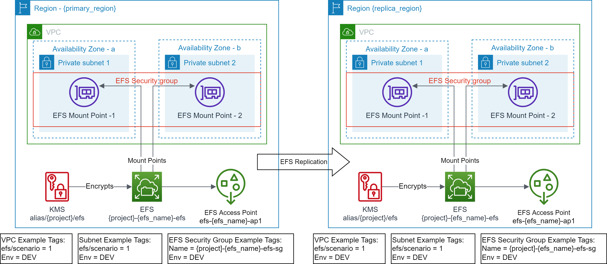

# Scenario 4: Create Amazon EFS and Amazon EFS Access Point(s) with replication enabled to another region
This scenario demonstrates the Amazon EFS file system replication. The Amazon EFS file system can be replicated to the same or another AWS Region. The replicated file system just replicates the storage. It does not create the mount target(s) or replicate the access point(s). This solution not only replicates the Amazon EFS file system but also creates the specified mount targets and access points(s).

## Prerequisites

<p align="center"></p>

- Terraform backend provider and state locking providers are identified and bootstrapped.
  - A [bootstrap](../../../bootstrap) module/example is provided that provisions Amazon S3 for Terraform state storage and Amazon DynamoDB for Terraform state locking.
- The target VPC along with the target Subnets exist and identified via Tags.
  - A [vpc](../../../vpc) example is provided that provisions VPC, Subnets and related resources with example tagging.
  - The example uses the following tags to identify the target VPC and Subnets.
    ```text
    "efs/scenario" = "1"
    "Env"          = "DEV"
    ```
- EFS file system does not exist.
- EFS Security Group does not exist.
- EFS mount targets do not exist in the target VPC Subnets.
- EFS access point does not exist.
- EFS replication does not exists
- EFS Security Group does not exist in the `replica_region`.
- EFS mount targets do not exist in the target VPC Subnets in the `replica_region`.
- EFS access point does not exist in the `replica_region`.

## Outcome

<p align="center"></p>

- EFS file system is created.
- EFS Security Group is created with default rules.
- EFS mount targets are created in the target VPC Subnets.
- EFS access point(s) are created.
- Standardized EFS resource policy is created.
- EFS replication is created in the `replica_region`
- EFS Security Group is created in the `replica_region` with default rules.
- EFS mount targets are created in the target VPC Subnets in the `replica_region`.
- EFS access point(s) are created in the `replica_region`.
- Standardized EFS resource policy is created in the `replica_region`

## Execution

- cd to `examples/efs/scenario4` folder.
- Modify the `backend "S3"` section in `provider.tf` with correct values for `region`, `bucket`, `dynamodb_table`, and `key`.
  - Use provided values as guidance.
- Modify `terraform.tfvars` to your requirements.
  - Use provided values as guidance.
- Make sure you are using the correct AWS Profile that has permission to provision the target resources.
  - `aws sts get-caller-identity`
- Execute `terraform init` to initialize Terraform.
- Execute `terraform plan` and verify the changes.
- Execute `terraform apply` and approve the changes to provision the resources.

<!-- BEGIN_TF_DOCS -->
## Requirements

| Name | Version |
|------|---------|
| <a name="requirement_terraform"></a> [terraform](#requirement\_terraform) | >= v1.1.9 |
| <a name="requirement_aws"></a> [aws](#requirement\_aws) | >= 4.13.0 |

## Providers

No providers.

## Modules

| Name | Source | Version |
|------|--------|---------|
| <a name="module_owned_efs"></a> [owned\_efs](#module\_owned\_efs) | ../../../modules/aws/efs | n/a |
| <a name="module_owned_efs_replica_usw1"></a> [owned\_efs\_replica\_usw1](#module\_owned\_efs\_replica\_usw1) | ../../../modules/aws/efs_replica | n/a |

## Resources

No resources.

## Inputs

| Name | Description | Type | Default | Required |
|------|-------------|------|---------|:--------:|
| <a name="input_env_name"></a> [env\_name](#input\_env\_name) | Environment name e.g. dev, prod | `string` | n/a | yes |
| <a name="input_project"></a> [project](#input\_project) | Project name (prefix/suffix) to be used on all the resources identification | `string` | n/a | yes |
| <a name="input_region"></a> [region](#input\_region) | The AWS Region e.g. us-east-1 for the environment | `string` | n/a | yes |
| <a name="input_subnet_tags"></a> [subnet\_tags](#input\_subnet\_tags) | Tags to discover target subnets in the VPC, these tags should identify one or more subnets | `map(string)` | n/a | yes |
| <a name="input_tags"></a> [tags](#input\_tags) | Common and mandatory tags for the resources | `map(string)` | n/a | yes |
| <a name="input_vpc_tags"></a> [vpc\_tags](#input\_vpc\_tags) | Tags to discover target VPC, these tags should uniquely identify a VPC | `map(string)` | n/a | yes |
| <a name="input_efs_access_point_specs"></a> [efs\_access\_point\_specs](#input\_efs\_access\_point\_specs) | List of EFS Access Point Specs to be created. It can be an empty list. | <pre>list(object({<br>    efs_ap          = string # unique name e.g. common_sftp<br>    uid             = number<br>    gid             = number<br>    secondary_gids  = list(number)<br>    root_path       = string # e.g. /{env}/{project}/{purpose}/{name}<br>    owner_uid       = number # e.g. 0<br>    owner_gid       = number # e.g. 0<br>    root_permission = string # e.g. 0755<br>    principal_arns  = list(string)<br>  }))</pre> | `[]` | no |
| <a name="input_efs_id"></a> [efs\_id](#input\_efs\_id) | EFS File System Id, if not provided a new EFS will be created | `string` | `null` | no |
| <a name="input_kms_alias"></a> [kms\_alias](#input\_kms\_alias) | KMS Alias to discover KMS for EFS encryption, if not provided, a new CMK will be created | `string` | `null` | no |
| <a name="input_security_group_tags"></a> [security\_group\_tags](#input\_security\_group\_tags) | Tags used to discover EFS Security Group, if not provided, a new EFS security group will be created | `map(string)` | `null` | no |

## Outputs

| Name | Description |
|------|-------------|
| <a name="output_efs"></a> [efs](#output\_efs) | Elastic File System info |
| <a name="output_efs_ap"></a> [efs\_ap](#output\_efs\_ap) | Elastic File System Access Points |
| <a name="output_efs_replica_ap_usw1"></a> [efs\_replica\_ap\_usw1](#output\_efs\_replica\_ap\_usw1) | Replicated Elastic File System Access Points |
| <a name="output_efs_replica_usw1"></a> [efs\_replica\_usw1](#output\_efs\_replica\_usw1) | Replicated Elastic File System info |
<!-- END_TF_DOCS -->
